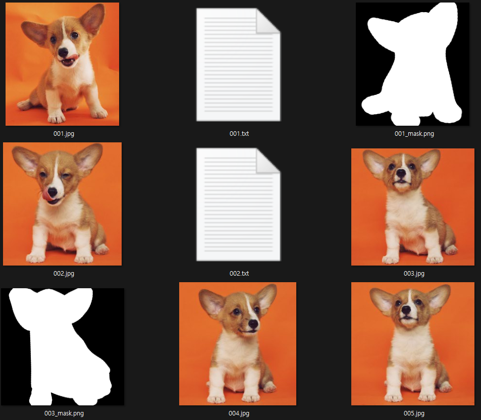
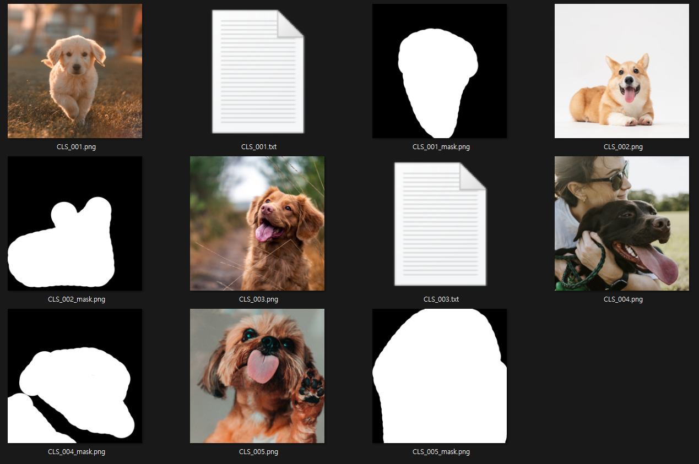
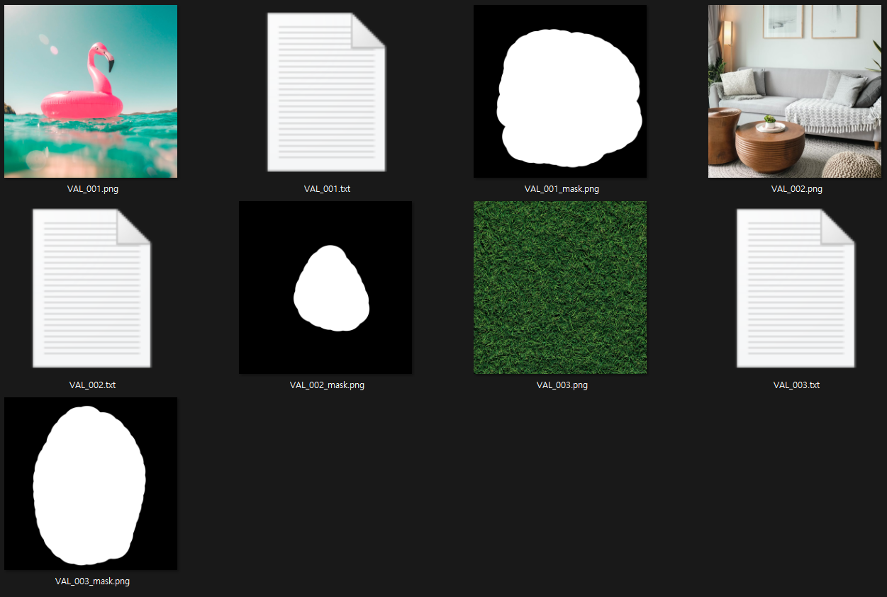
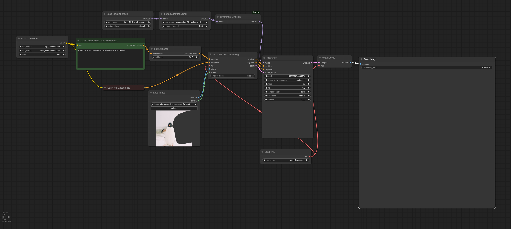

# FLUX.1-Fill-dev LoRA Training

## ⚠️Important Note

> This script requires a GPU with a lot of VRAM, ideally 80GB or more. Please ensure you have the necessary hardware before running the script. This script was successfully run on RunPod using an A100 GPU.

This repository provides code for training LoRAs (Low-Rank Adaptations) for the [black-forest-labs/FLUX.1-Fill-dev](https://huggingface.co/black-forest-labs/FLUX.1-Fill-dev) model. It is based on the repository [Sebastian-Zok/FLUX-Fill-LoRa-Training](https://github.com/Sebastian-Zok/FLUX-Fill-LoRa-Training) but has been modified to fit my use case.

## Key Features

* **Customizable Data Directories**: You can specify separate directories for instance, class, and validation data.
* **Data Organization**: Each data directory can contain the following files, which are grouped by `<name>`:
    * `<name>.png`: The image file to be used for training.
    * `<name>_mask.png`: A mask image file where the area to be filled is painted white.
    * `<name>.txt`: A text file containing the image caption.

## Example

See the `tutorial` directory for an example of how to organize your data.

## Usage

```bash
git clone https://github.com/hvppycoding/hvppyfluxfill.git
cd hvppyfluxfill
pip install -e .

accelerate config default

huggingface-cli login
# Enter huggingface API token

pip install wandb
```

```bash
# prodigy
# Execute the code from within the `tutorial` directory.
# The example commands are not optimized and are provided for illustrative purposes only.
# Feel free to share any better configurations you may have!
pip install prodigyopt

accelerate launch ../hvppyfluxfill_main.py \
  --pretrained_model_name_or_path="black-forest-labs/FLUX.1-Fill-dev" \
  --instance_prompt="A sks dog" \
  --instance_data_dir="./train_data" \
  --with_prior_preservation \
  --class_prompt="A dog" \
  --class_data_dir="./class_data" \
  --validation_prompt="A sks dog" \
  --validation_data_dir="./validation_data" \
  --validation_epochs=25 \
  --validation_repeats=2 \
  --output_dir="sks-dog-flux-fill-training" \
  --mixed_precision="bf16" \
  --resolution=768 \
  --train_batch_size=1 \
  --guidance_scale=1 \
  --gradient_accumulation_steps=1 \
  --optimizer="prodigy" \
  --learning_rate=1. \
  --report_to="wandb" \
  --lr_scheduler="constant" \
  --lr_warmup_steps=200 \
  --max_train_steps=1000 \
  --rank=8 \
  --checkpointing_steps=100 \
  --seed="0" \
  --resume_from_checkpoint=latest \
  --push_to_hub
```

```bash
# AdamW 8bit
# Execute the code from within the `tutorial` directory.
# The example commands are not optimized and are provided for illustrative purposes only.
# Feel free to share any better configurations you may have!
pip install bitsandbytes

accelerate launch ../hvppyfluxfill_main.py \
  --pretrained_model_name_or_path="black-forest-labs/FLUX.1-Fill-dev" \
  --instance_prompt="A sks dog" \
  --instance_data_dir="./train_data" \
  --with_prior_preservation \
  --class_prompt="A dog" \
  --class_data_dir="./class_data" \
  --validation_prompt="A sks dog" \
  --validation_data_dir="./validation_data" \
  --validation_epochs=25 \
  --validation_repeats=2 \
  --output_dir="sks-dog-flux-fill-training-adam" \
  --mixed_precision="bf16" \
  --resolution=768 \
  --train_batch_size=1 \
  --guidance_scale=1 \
  --gradient_accumulation_steps=1 \
  --optimizer="AdamW" \
  --use_8bit_adam \
  --learning_rate=1e-4 \
  --report_to="wandb" \
  --lr_scheduler="constant" \
  --lr_warmup_steps=200 \
  --max_train_steps=1000 \
  --rank=8 \
  --checkpointing_steps=100 \
  --seed="0" \
  --resume_from_checkpoint=latest \
  --push_to_hub
```

## 1. `instance_data_dir`



This directory contains images of the specific objects or subjects you want to train the model on. These are often referred to as "instance" images, and they are typically labeled with rare tokens that describe the specific instance.

* **Rare Tokens**: These are unique identifiers that represent the specific instance. For example:
    * `sks dog`:  This could represent a specific dog breed or even a particular dog.
    * `eoin man`: This could represent a specific person.

* **Purpose**: The images in this directory are used to fine-tune the model to generate or manipulate images of these specific instances.

## 2. `class_data_dir`



This directory contains images of more general concepts related to the instances in `instance_data_dir`. These are used for prior preservation, which helps the model maintain its ability to generate diverse and realistic images while still learning the specific instances.

* **General Concepts**: These are broader categories that encompass the instances. For example:
    * `dog`: This is a general category that includes all types of dogs.
    * `man`: This is a general category that includes all men.

* **Purpose**: The images in this directory help the model understand the broader context of the instances and prevent it from overfitting to the specific details of the instance images.

## 3. `validation_data_dir`



This directory contains images used to evaluate the performance of the trained model during the training process. These images are not used for training the model itself.

* **Evaluation**: These images are used to assess how well the model is learning to generate or manipulate images of the specific instances.

* **Purpose**: By monitoring the model's performance on the validation set, you can adjust the training process and hyperparameters to achieve better results.

## Tutorial result

The following image shows the results of training the model on the `sks dog` instance using the `tutorial` data.  

prompts: `A photo of a sks dog standing up and barking at a penguin.`


The image is generated via ComfyUI.


